## Hexodus

An idle game about cleaning up space trash, built in a week while learning more about c, cpp and graphics programming for the **raylib 6 game jam**.

### Description

Take control of the Hexodus I, a ship doomed with the task of cleaning up all the space trash in order to get back home. Mine trash with your lasers, upgrade your ships technology, and even bring in the help of additional ships!!! Arm and launch the mega-laser after you've unlocked everything in the tech tree for maximum effect!

### Features

 - Two modes: a campaign with an ending cinematic, and an endless unlimited mode
 - Four currencies and a four-branch hex tech tree (Technology / Firepower / Automation / Mobility)
 - A growing fleet of auto-piloted ships with mountable turrets
 - Chain lasers, catcher platforms, particles, and a CRT-style bloom shader
 - Custom-built ECS and particle system on top of the raylib game template

### Controls

Mouse / touch:
 - Click or tap to move your ship (until Auto Nav takes over!)
 - Click the top-right buttons to open the upgrade tree, toggle Auto Nav, and ARM/FIRE the Mega Laser

Keyboard:
 - ESC - pause menu (music toggle, quit)

### Screenshots

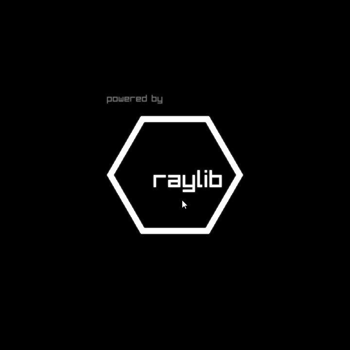
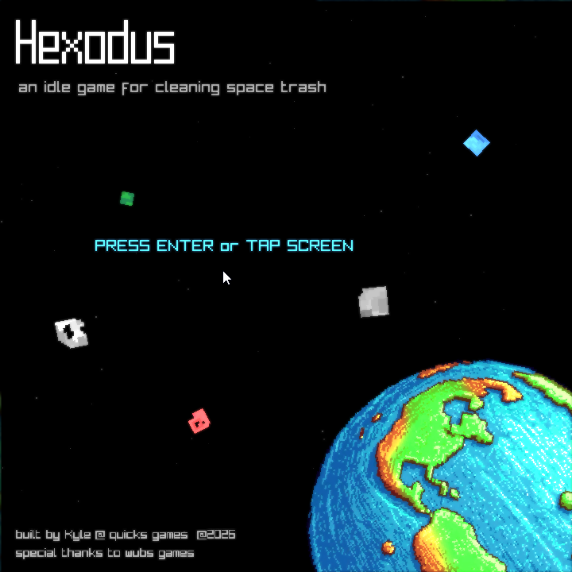
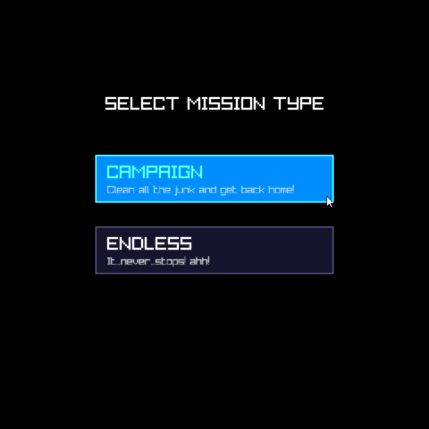
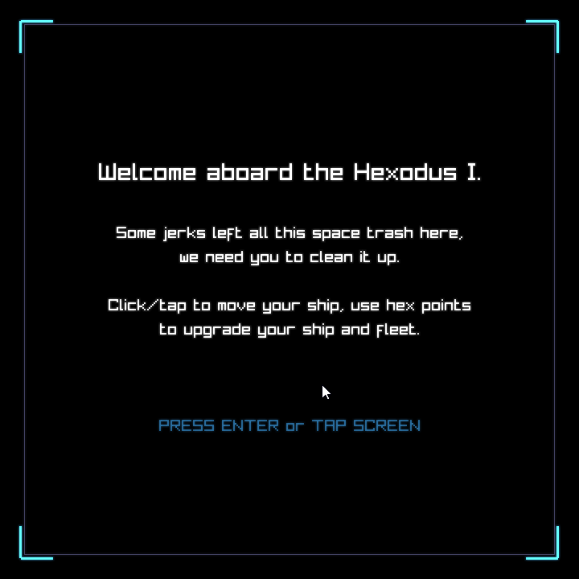
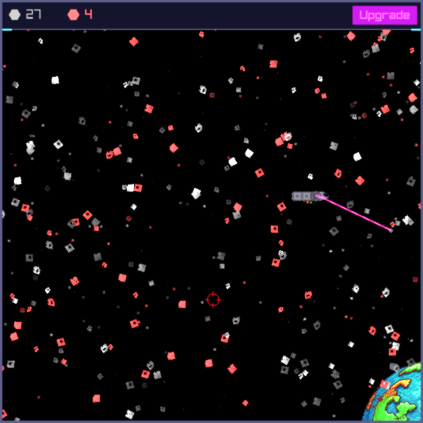
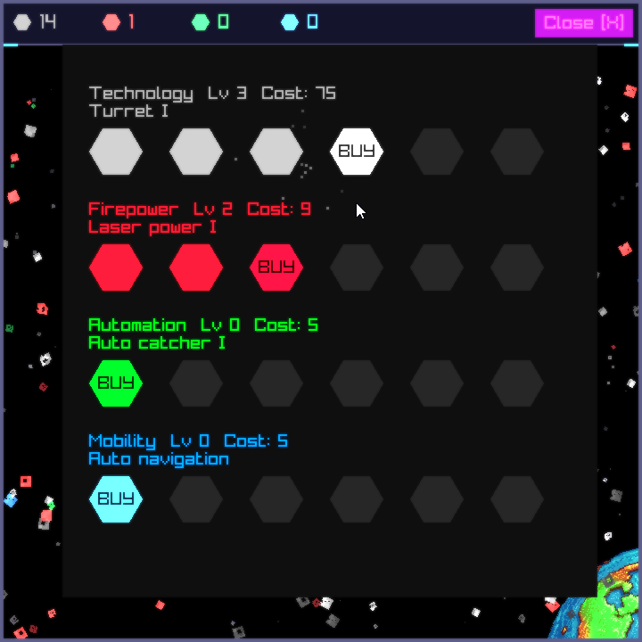
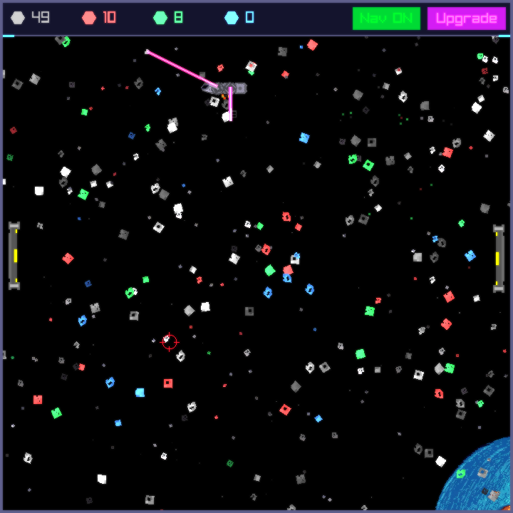
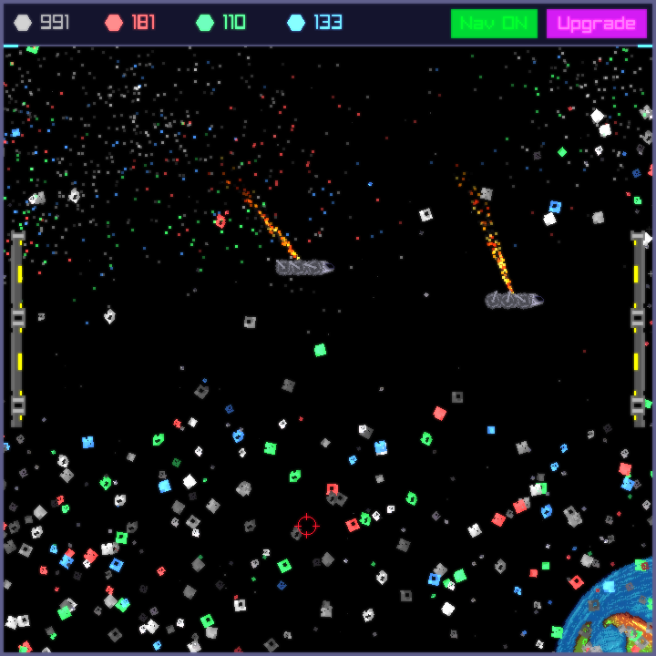
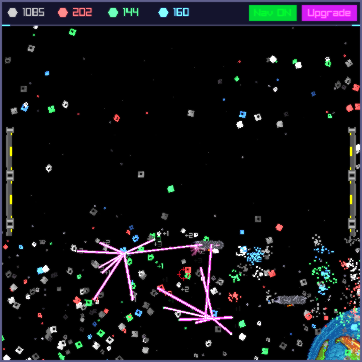
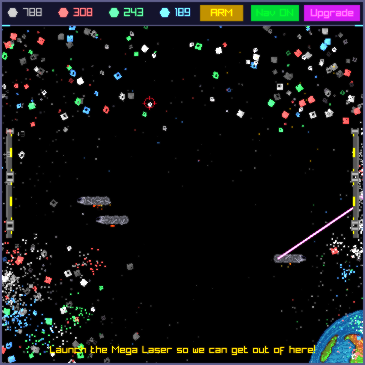
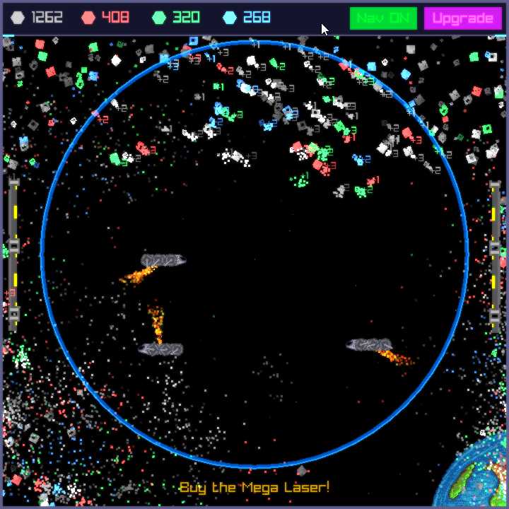

### Developers

 - Kyle "Klutch" @ quicks games - design, code, art
 - wubs games - planet sprites, soundtrack, and popping sounds

### Links

 - itch.io Release: $(itch.io Game Page)

### License

This project sources are licensed under an unmodified zlib/libpng license, which is an OSI-certified, BSD-like license that allows static linking with closed source software. Check [LICENSE](LICENSE) for further details.

Built with [raylib](https://www.raylib.com) — Copyright (c) 2014-2026 Ramon Santamaria ([@raysan5](https://github.com/raysan5))

*Copyright (c) 2026 Kyle @ quicks games*
